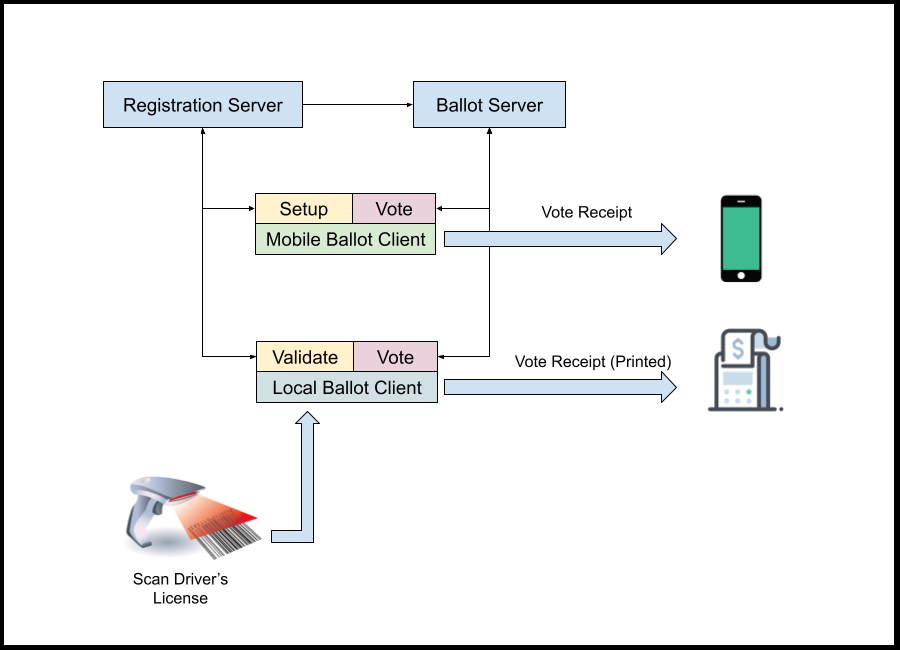

# Open Ballot

Open Ballot is an open source voting platform.

The system allows for citizens to vote using their smart-phones.

At first glance, this may sound like madness, but this system is designed to be more secure, more transparent and far more difficult to defraud than any system currently in existance.

The first level of proof in this endeavor is that it is Open Source.  If any government or citizen, local or otherwise wanted to view the inner workings of the system - they are more than welcome to do so.

## Phases

* **Pre Election** - The pre-election phase is designated as the period of time before an active election year.  During this time, Citizens can register to vote and sign in to the mobile app at any time to view their voting status.  Several modules can be employed to validate registration against known public records.  (prevents deceased citizen voting.)

* **Election Preparation** - The Election Preparation phase is designated as being the first 10 months of an election year.  During this time, several reminders are sent via mail, email and/or SMS text for each Citizen to validate their registration information and "Verify" their voting status.  (This is designed to prevent deceased voters from voting.)

* **Election Setup** - The Election Setup is designated as a period 1 month before the Election.  During this time, the machines are re-imaged and the latest version of "Open Ballot" is installed.  The machines are then registered with the Registration Server and are issued a connection token.

* **Election Day** - The Voting Servers are set to receive votes.  Election machines use their connection tokens to connect to the vote server and must maintain an active connection for the entire day.  Any machine that drops its connection cannot reconnect.  (This prevents unregistered machines from connecting or hijacking a connection)

* **Ballots Cast** - During election day, each ballot that is finished by a citizen is encrypted using that citizen's personal encryption key.  Each ballot is stored in a "vote" record with a highly encrypted ballot.  (This prevents vote switching because the ballots CANNOT be decrypted by poll workers.  Ballots are only visible to the voter casting it.)

* **Election Polls Closing** - The vote server is closed and all connections are dropped.  The "Vote Tally" algorythim then runs taking the following into account:  

1. Each vote is matched to a record on the Registration Server (preventing ballot stuffing).  
2. The Ballot is decrypted, counted and then dropped from memory.  
3. The Analytics algorithm runs concurrently making sure that the vote count does not exceed the registration count AND that the total votes do not exceed the maximum allowable votes (preventing vote weighting)

**NOTE** : All vote counts are stored as unsigned integers.  (prevents vote weighting)

* **Election Results** - This is the final phase where the winners are announced given the results.

* **Election Validation** - If there are any disputes over the machine count, each voter that cast a ballot will have a receipt of the vote AND a copy of their encrypted ballot.  They can check the results of their ballot at any time following election day.  (Preventing vote-switching / Ballot healing)

 

# Process

The election of a government official is predecated on a process.  All governments have their own process and may not fit with the necessary workflow to implement this system.  But if they are, then the processess outline here is the process that must be in place for this system to be implemented successfully.  (Securely).

 

# Hardware

## Servers

Open Ballot consists of two server domains working in concert.

* **Registration Server**
* **Ballot Server**

The **Registration Server** operates in the time period before the election.  The server also serves to control the election environment.  (See Procedures)

The **Ballot Server** is active on election day from a start time to an end time.  During this time, the server accepts votes being cast by the **Participants**.

## Clients 

These servers are served by two different types of Clients.

* **Mobile Ballot Client**
* **Local Ballot Client**

The **Mobile Client** runs on individual smart phones.  This Client is issued a single session on election day and allows a single ballot to be cast.

The **Local Client** runs on devices in local precincts.  These machines can have a variable session that casts a single vote on behalf of a registered user.

----

## Mobile Vote Overview

1. A **Participant** wishing to use the **Mobile Ballot Client** must first register online or in person at a state agency that allows voter registration. 

1. The **Participant** is then able to visit the Registration Website and access the  **Mobile Ballot Client** Application.  This Application is a PWA (Progressive Web App).

1. Once the **Participant** logs in, they are shown their Registration profile and status.  

1. During the election year, they will be asked to verify their current information and voter status by scanning their State ID.  Once verified, they are ready for election day.

1. On election day, the **Participant** logs in to the Web App.  They are then given a Ballot, which they will be able to complete and cast within that day.

1. ALL Traffic from the Mobile App to the **Ballot Server** is encrypted over https AND the Ballot itself is AES encrypted with the personal key of the **Participant**.

1. The **Ballot Server** takes the Ballot and matches the **RegistrantId** to the Registrant record.  At this point, the Ballot is Decrypted and the vote counted.

1. The **Ballot Server** responds with the ID of the cast Ballot as a Receipt, which is stored on the Mobile Client.  At any time, the **Participant** can query their Ballot from the server and view the *Cast Ballot* and compare it to their local copy.

----

## Roles

### Participant
The Individual Voter.  They **MUST** be registered and they must validate their voting status before election day in order to be able to vote.

### Registration Clerk
These are local governmental officials that help a citizen register to vote.  They must verify the voter's information on the registration server and either provide an account for the individual to log into, or (if they do not have a smartphone) they will can use the local machines at their voting location by scanning their driver's license.

### Observer
APIs for newsfeeds, election oververs, etc.  The observer role **CANNOT CHANGE ANYTHING** - they can only observe the process and measure any irregularites.

Observer roles connected to the main servers before the election, which allows their client application to view the status of ALL machines.  

Any Machine that is disconnected in any way, during the election cannot be reconnected - thus a valid election machine must be connectd to an Uninterrupted Power Supplies (UPS) 

### PollWorker
This role allows a local machine to create a new local voting session by manning a machine that scans a driver's license.

----

## Procedures

### Pre-Election

1. The **Registration Server** will accept requests for Voter Registration.  These requests **MUST** be validated by a qualified State Employee in the presense of the **Participant** being registered.

1.  In the same year as an election, the **Participant** must validate their registration using their **Mobile Client** in order to vote using that **Mobile CLient** - if they fail to do this, they may still vote in person.

### Election Environment

The procedures for an Election rely on the Legal statutes outlined by the constitution and the legislators.

1. All Software must be installed fresh on the **Local Clients** one month prior to an election.  The version of the software being installed must record the **code hash** before **AND AFTER** the election to prove that the machines were not tampered with. 

1. All Election Machines must be connected the day before the election **AND MAINTAIN THEIR CONNECTION** throughout the election.  Any machine that loses its connection cannot be reconnected.

1. The day before the election, the **Vote Servers** must be turned on and connected to the **Registration Server**.  They will go active on a specific time.

1. The Registration Server and the Voting Server must be programmed to refuse connections from each other until **AFTER** the allowed voting period has passed.

1. When polling is closed, the **Tabulation Process** begins.  This allows for a connection between the **Registration Server** and the **Voting Server** for a single process - the tabulation.  If the process is interrupted in any way, then the results table will be dropped and reset for another run.

During this time, the vote is matched to each vother record, the ballot is decrypted using the voter's key and the ballot results counted.

1. The final results are copied to a local file that can be served via https: to reporting agencies, news outlets, observers, etc.

1. The tabulation database is then dumped to a file that is to be backed-up and archived for a period defined by legal statute.